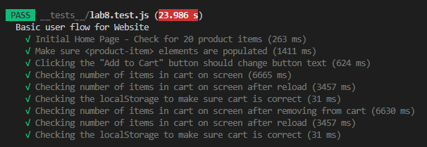

# Lab 8 - Starter

Alex Wang

1) Where would you fit your automated tests in your Recipe project development pipeline? Select one of the following and explain why.
   - Within a Github action that runs whenever code is pushed. The other options are problematic because running tests locally will most likely be different for everybody in the group, and running tests after development will most likely cause many problems within the code that would be difficult to debug with some many connected parts. 

2) Would you use an end to end test to check if a function is returning the correct output? (yes/no)
   - No

3) Would you use a unit test to test the “message” feature of a messaging application? Why or why not? For this question, assume the “message” feature allows a user to write and send a message to another user.
    - No, because testing a messaging system requires components to interact with each other which cannot be unit tested.

4) Would you use a unit test to test the “max message length” feature of a messaging application? Why or why not? For this question, assume the “max message length” feature prevents the user from typing more than 80 characters.
    - Yes, because the "max message length" feature does not require components to interact with each other which can be unit tested.

